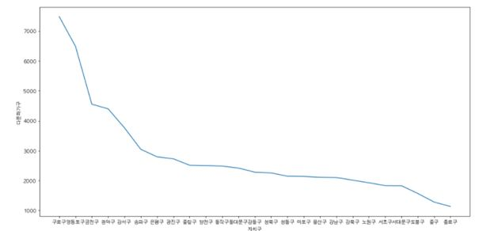
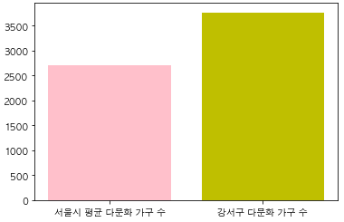
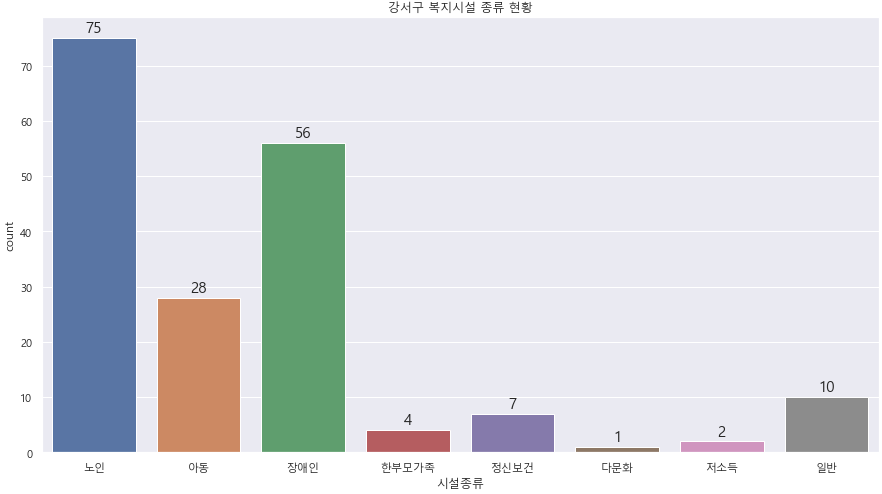
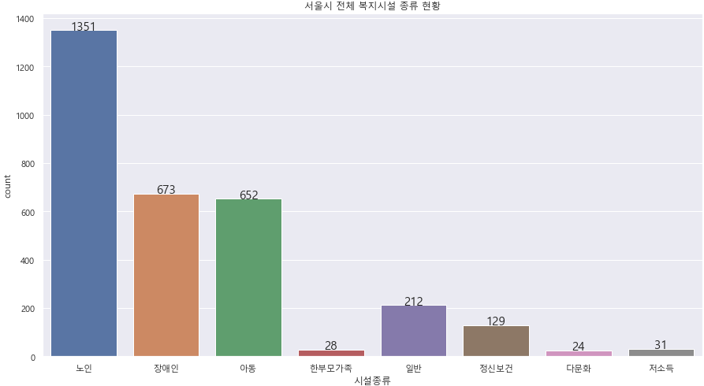
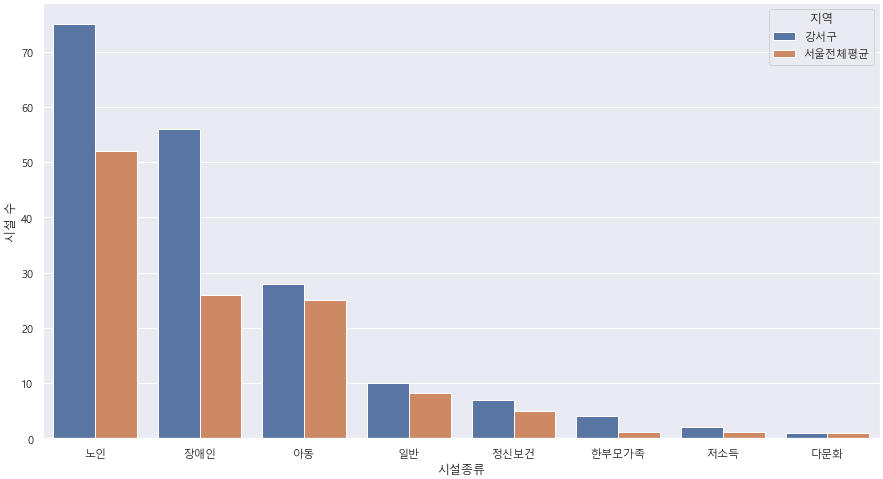
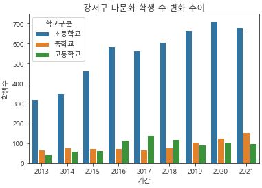
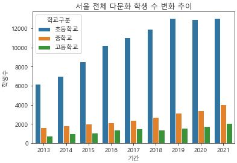
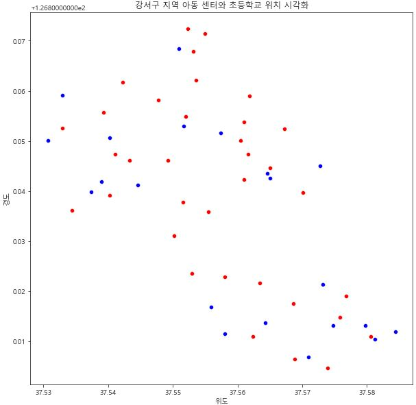
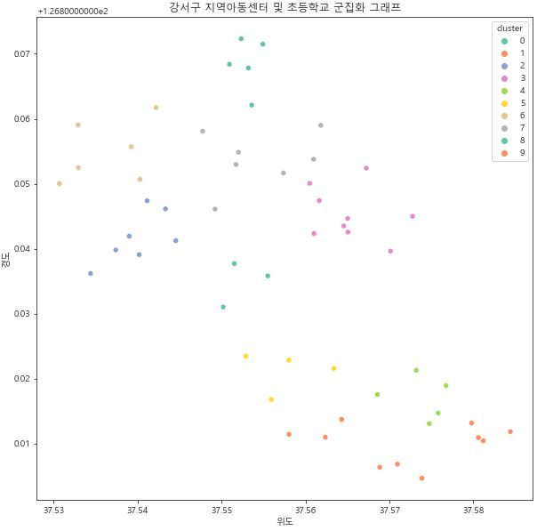

# 강서구 공공데이터 프로젝트

이 프로젝트는 강서구 빅데이터 활용 공모전에 출품하기 위해서 시작된 프로젝트이다.

## 문제 정의

__1. 다문화 학생 수 증가__
+ 꾸준한 국제 결혼 및 이민 등으로 다문화 가정 수 증가

+ 학령기의 다문화 가정 비중 증가

  + 통계청에 따르면 학령기(만 7세에서 18세)의 다문화 학생은 2016년 9만 9천여 명에서 2021년에는 16만여 명으로 역대 최고로 많았다. 전체 학생 가운데 다문화 학생의 비율도 2016년 1.7%에서 2021년 3.0%까지 증가하였다. 100명 중 3명이 다문화 학생이라는 뜻이다.
    
  + 다문화 학생의 학업 생활의 어려움
    + 여성가족부에 따르면 다문화 학생의 대학 등 고등교육기관 진학률은 49.6%로 국민 전체 67.6%보다 18%p나 낮았다. 학교생활에 어려움을 겪는 이유로는 '학교 공부의 어려워서'가 63.6%로 가장 많았고 '친구들과 어울리기 힘듦','한국어를 잘 못 해서', '외모가 달라서', '교사의 차별' 등이 뒤를 이었다.
      


__2. 기존의 다문화 학생의 복지의 문제점__
+ 다문화 가족 학령기 프로그램이나 지원 정책 미흡
+ 어려움을 토로할 소통 창구의 부재

__결론 : 다문화 가정의 교육 지원이 필요하다__


## 데이터 수집
+ 공공데이터 포털에서 데이터 수집

  + 서울특별시 사회복지시설 목록

  + 강서구 사회복지시설 목록

  + 서울시 다문화 가구 현황 통계

  + 2013~2021 서울시 다문화가정 학생 수

  + 강서구 초등학교 위치 데이터

  + 강서구 아동 복지시설 위치 데이터

    

## 데이터 확인 및 전처리

### 서울 특별시 사회복지시설 목록

+ 데이터 확인
  ```import pandas as pd
  import pandas as pd
  import numpy as np
  
  seoul_welfare = pd.read_csv("../data/서울특별시 사회복지시설 목록.csv",encoding = "cp949")
  ```
  
+ 서울특별시 사회복지시설 목록 데이터는 다음과 같은 칼럼을 가진다.

| 시설명 | 시설코드 | 시설종류명(시설유형) | 시설종류상세명(시설종류) | 자치구(시)구분 | 시설장명 | 시군구코드 | 시군구명 | 시설주소 |
| ------ | -------- | -------------------- | ------------------------ | -------------- | -------- | ---------- | -------- | -------- |

+ 시설종류에 따른 복지시설의 목록을 확인하기 위하여 시설 종류를 구분한다.

+ 시설종류는 노인, 아동, 장애인, 한부모가족, 정신보건, 건강가정, 다문화, 저소득, 일반으로 구분되었다.


### 강서구 사회복지시설 목록

+ 데이터 확인

  ```python
  import pandas as pd
  import numpy as np
  
  gangseo_welfare = pd.read_csv("../data/강서구 복지시설.csv")
  ```

+ 강서구 사회복지시설 목록 데이터는 다음과 같은 칼럼을 가진다.

  | 시설명 | 시설코드 | 시설종류명(시설유형) | 시설종류상세명(시설종류) | 자치구(시)구분 | 시설장명 | 시군구코드 | 시군구명 | 시설주소 | 위도 | 경도 |
  | ------ | -------- | -------------------- | ------------------------ | -------------- | -------- | ---------- | -------- | -------- | ---- | ---- |

+ 시설종류에 따른 복지시설의 목록을 확인하기 위하여 시설 종류를 구분한다.

+ 시설종류는 노인, 아동, 장애인, 한부모가족, 정신보건, 건강가정, 다문화, 저소득, 일반으로 구분되었다.


### 서울시 다문화 가구 현황 통계

+ 데이터 확인

  ```python
  import pandas as pd
  
  df=pd.read_csv('다문화가정데이터.csv',thousands=',')
  ```

+ 서울시 다문화 가구 현황 통계는 다음과 같은 칼럼을 가진다.

  | 기간 | 자치구 | 다문화가구 | 총계 | 내국인(출생) | 내국인(귀화) | 외국인(결혼이민자) | 외국인(기타) |
  | ---: | -----: | ---------: | ---: | -----------: | -----------: | -----------------: | -----------: |
  |      |        |            |      |              |              |                    |              |

+ 기간 데이터에 결측값이 확인되어 결측값을 처리했다

  ```python
  df1=df.fillna('2020')
  ```

+ 0번째 행은 합계정보에 해당하는 정보를 가지고 있기 때문에 삭제하였다.

  ```python
  df2=df1.drop(index=0,axis=0)
  ```

### 2013~2021 서울시 다문화가정 학생 수

+ 데이터 확인

  ```python
  import pandas as pd
  
  data = pd.read_excel("../data/2013~2021 다문화가정 학생 수.xls")
  ```

  | 기간 | 자치구 | 초등학교 | 초등학교.1 |   초등학교.2 |     중학교 | 중학교.1 |     중학교.2 |   고등학교 | 고등학교.1 |   고등학교.2 |            |
  | ---: | -----: | -------: | ---------: | -----------: | ---------: | -------: | -----------: | ---------: | ---------: | -----------: | ---------- |
  |    0 |   기간 |   자치구 |         계 | 국제결혼가정 | 외국인가정 |       계 | 국제결혼가정 | 외국인가정 |         계 | 국제결혼가정 | 외국인가정 |

+ 강서구 다문화 학생의 수를 분리하였다.

  ```python
  data_sum_g = []
  for i in range(len(data)):
      if "강서구" in data.iloc[i]["자치구"]:
          data_sum_g.append(data.iloc[i])
  data_sum_g_df = pd.DataFrame(data_sum_g)
  ```

### 강서구 초등학교 위치 데이터 & 강서구 아동복지시설 위치 데이터

+ 데이터 확인

  ```python
  import pandas as pd
  
  e_data = pd.read_csv("../data/강서구초등학교위도경도.csv")
  a_data = pd.read_csv("../data/강서구 아동복지시설위도경도.csv")
  ```

  | 학교명 | 위도 | 경도 |
  | -----: | ---: | ---: |
  |        |      |      |

  | 시설명 | 시설코드 | 시설종류명(시설유형) | 시설종류상세명(시설종류) | 자치구(시)구분 | 시설장명 | 시군구코드 | 시군구명 | 시설주소 | 위도 | 경도 |
  | -----: | -------: | -------------------: | -----------------------: | -------------: | -------: | ---------: | -------: | -------: | ---: | ---: |
  |        |          |                      |                          |                |          |            |          |          |      |      |

+ 아동복지시설 데이터에서 필요한 정보만을 추렸다.

  ```python
  a_data_c = a_data[["시설명","시설종류명(시설유형)","위도","경도"]]
  ```

  


## 데이터 시각화

가져온 데이터가 어떤 정보를 가지고 있는지 확인하기 위하여 시각화를 진행하였다.

시각화는 다음 정보를 기초로 시각화하였다.

1. 강서구 다문화 인구 시각화
2. 서울시 평균 다문화 가정과 강서구 다문화 가정 수 비교
3. 강서구 사회복지시설 현황 시각화
4. 강서구 다문화 학생 비율 시각화


### 강서구 다문화 인구 시각화

+ 서울시 전체 26개 구의 다문화 인구수를 시각화하였다.

  ```python
  df3 = df2.sort_values('다문화가구', ascending=False)
  plt.figure(figsize = (16,8))
  
  sns.lineplot(
      x = '자치구',
      y = '다문화가구',
      data = df3,
  )
  ```

      


### 서울시 평균 다문화 가정과 강서구 다문화 가정 수 비교

+ 서울시 평균 다문화 가정의 수와 강서구 다문화 가정 수를 비교하였다.

  ```python
  import matplotlib.pyplot as plt
  import numpy as np
  
  x = np.arange(2)
  seoul = ['서울시 평균 다문화 가구 수', '강서구 다문화 가구 수']
  values = [2701.6, 3766]
  
  plt.bar(x, values,color=['pink','y'])
  plt.xticks(x,seoul)
  
  plt.show()
  ```

      

+ 서울시 평균 다문화 가정 인구수와 강서구 다문화 가정 인구수를 비교하였다.

  ```python
  import matplotlib.pyplot as plt
  import numpy as np
  
  x = np.arange(2)
  seoul = ['서울시 평균 다문화 가구 수', '강서구 다문화 가구 수']
  values = [2701.6, 3766]
  
  plt.bar(x, values,color=['pink','y'])
  plt.xticks(x,seoul)
  
  plt.show()
  ```

      

+ 서울시 평균 다문화 가정 및 다문화 인구수에 비해 다문화 가정의 인구수가 약 1.3배정도 많다

  

### 서울시 복지시설 및 강서구 복지시설 현황

+ 서울시 복지시설의 시설종류 만을 저장하였다.

  ```python
  seoul_welfare_facility = []
  for row in seoul_welfare["시설종류명(시설유형)"]:
      if "노인" in row:
          seoul_welfare_facility.append("노인")
      elif "아동" in row:
          seoul_welfare_facility.append("아동")
      elif "장애인" in row:
          seoul_welfare_facility.append("장애인")
      elif "한부모가족" in row:
          seoul_welfare_facility.append("한부모가족")
      elif "정신보건" in row:
          seoul_welfare_facility.append("정신보건")
      elif "건강가전" in row:
          seoul_welfare_facility.append("건강가전")
      elif "다문화" in row:
          seoul_welfare_facility.append("다문화")
      elif "저소득" in row:
          seoul_welfare_facility.append("저소득")
      else:
          seoul_welfare_facility.append("일반")
  seoul_welfare_facility = pd.DataFrame(seoul_welfare_facility,columns=["시설종류"])
  ```

+ 강서구 복지시설의 시설종류 만을 저장하였다.

  ```python
  gangseo_welfare_facility = []
  for row in gangseo_welfare["시설종류명(시설유형)"]:
      if "노인" in row:
          gangseo_welfare_facility.append("노인")
      elif "아동" in row:
          gangseo_welfare_facility.append("아동")
      elif "장애인" in row:
          gangseo_welfare_facility.append("장애인")
      elif "한부모가족" in row:
          gangseo_welfare_facility.append("한부모가족")
      elif "정신보건" in row:
          gangseo_welfare_facility.append("정신보건")
      elif "건강가전" in row:
          gangseo_welfare_facility.append("건강가전")
      elif "다문화" in row:
          gangseo_welfare_facility.append("다문화")
      elif "저소득" in row:
          gangseo_welfare_facility.append("저소득")
      elif "일반" in row:
          gangseo_welfare_facility.append("일반")
  
  gangseo_welfare_facility = pd.DataFrame(gangseo_welfare_facility,columns=["시설종류"])
  ```

+ 비교시각화를 위해 두 데이터를 병합하였다.

  ```python
  # 강서구 데이터 전처리
  gangseo_welfare_count = gangseo_welfare_facility.value_counts()
  gangseo_welfare_count_df = pd.DataFrame(gangseo_welfare_count,columns = ["시설 수"])
  gangseo_welfare_count_df = gangseo_welfare_count_df.reset_index()
  gangseo_welfare_count_df["지역"] = "강서구"
  
  # 서울시 데이터 전처리
  seoul_welfare_count = np.round(seoul_welfare_facility.value_counts()/26,1)
  seoul_welfare_count_df = pd.DataFrame(seoul_welfare_count,columns = ["시설 수"])
  seoul_welfare_count_df = seoul_welfare_count_df.reset_index()
  seoul_welfare_count_df["지역"] = "서울전체평균"
  
  # 데이터 병합
  welfare = pd.concat([gangseo_welfare_count_df,seoul_welfare_count_df])
  ```

+ 강서구 복지시설 현황을 시각화하였다.

  ```python
  import matplotlib.pyplot as plt
  import seaborn as sns
  
  sns.set_style("ticks")
  sns.set(rc = {'figure.figsize':(15,8)})
  plt.rc('font',family = 'Malgun Gothic')
  plt.title("강서구 복지시설 종류 현황")
  ax = sns.countplot(x = "시설종류",data = gangseo_welfare_facility)
  for p in ax.patches:
      height = p.get_height()
      ax.text(p.get_x() + p.get_width() / 2., height + 1, height, ha = 'center', size = 15)
  plt.show()
  ```

      

+ 서울시 복지시설 현황을 시각화하였다.

  ```python
  sns.set_style("ticks")
  sns.set(rc = {'figure.figsize':(15,8)})
  plt.rc('font',family = 'Malgun Gothic')
  plt.title("서울시 전체 복지시설 종류 현황")
  ax = sns.countplot(x = "시설종류",data = seoul_welfare_facility)
  for p in ax.patches:
      height = p.get_height()
      ax.text(p.get_x() + p.get_width() / 2., height + 1, height, ha = 'center', size = 15)
  plt.show()
  ```

      

+ 서울시 복지시설 평균과 강서구 복지시설 수를 비교하였다.

  ```python
  import seaborn as sns
  p = sns.barplot(x=welfare["시설종류"],y=welfare["시설 수"],hue=welfare["지역"])
  plt.title("강서구 - 서울 복지시설 비교")
  plt.show()
  ```

      

+ 강서구의 복지시설은 서울 평균과 비교해보았을 때 그 수가 대체적으로 많다.

+ 그러나 다문화 복지시설은 타 복지시설과 비교하였으 때 그 수가 매우 부족하다.


### 다문화 학생 비율 시각화

+ 초등학교, 중학교, 고등학교 학생수에 대한 정보를 행으로 결합하였다.

  ```python
  data_sum_df_g_1 = data_sum_df_g[["기간","자치구","초등학교"]]
  data_sum_df_g_1["학교구분"] = "초등학교"
  data_sum_df_g_2 = data_sum_df_g[["기간","자치구","중학교"]]
  data_sum_df_g_2["학교구분"] = "중학교"
  data_sum_df_g_3 = data_sum_df_g[["기간","자치구","고등학교"]]
  data_sum_df_g_3["학교구분"] = "고등학교"
  
  data_sum_df_g_1.rename(columns={"초등학교":"학생수"},inplace=True)
  data_sum_df_g_2.rename(columns={"중학교":"학생수"},inplace=True)
  data_sum_df_g_3.rename(columns={"고등학교":"학생수"},inplace=True)
  
  data_sum_df_g_a = pd.concat([data_sum_df_g_1,data_sum_df_g_2,data_sum_df_g_3])
  data_sum_df_g_a
  ```

+ 연도별로 강서구 다문화 학생 수가 어떻게 변화하는지 시각화하였다. 2013년부터 2021년까지 강서구의 전체 다문화 학생을 초등학생, 중학생, 고등학생으로 나누어 보여준다.

  ```python
  import matplotlib.pyplot as plt
  import seaborn as sns
  
  sns.set_style("ticks")
  plt.rc('font',family = 'Malgun Gothic')
  p = sns.barplot(x=data_sum_df_g_a["기간"],y=data_sum_df_g_a["학생수"],hue=data_sum_df_g_a["학교구분"])
  plt.title("강서구 다문화 학생 수 변화 추이")
  plt.show()
  ```

      

+ 연도별로 서울시 다문화 학생 수가 어떻게 변화하는지 시각화하였다. 2013년부터 2021년까지 강서구의 전체 다문화 학생을 초등학생, 중학생, 고등학생으로 나누어 보여준다.

  ```python
  import matplotlib.pyplot as plt
  import seaborn as sns
  
  sns.set_style("ticks")
  plt.rc('font',family = 'Malgun Gothic')
  p = sns.barplot(x=data_sum_df_a["기간"],y=data_sum_df_a["학생수"],hue=data_sum_df_a["학교구분"])
  plt.title("서울 전체 다문화 학생 수 변화 추이")
  plt.show()
  ```

      

+ 다문화 학생수는 초등학교, 중학교, 고등학교를 거치며 큰 폭으로 줄어들어갔다.

+ 2013~2021년 서울과 강서구 모두 전체적인 다문화 학생 수는 증가하였지만, 진학을 하면서 학생수가 줄어드는 현상은 그대로이다.

+ 2013년에 초등학생이면 2020년에는 중학생 혹은 고등학생이어야 하지만 초등학생 수에 비해 중학생 고등학생의 수는 매우 적었다.

+ 초등학교는 6년, 중학교와 고등학교는 각각 3년의 교육기간인 것을 감안하여도 중학생과 고등학생의 합보다 초등학생의 숫자가 훨씬 많다.


## 시각화 결과 해석

### 다문화 학생의 교육 이탈 현상

+ 다문화 학생 일반적인 학생이라면 대부분 거치는 12년의 교육과정을 모두 이수하지 못한다고 보여진다.
+ 이 원인은 두 가지 이유로 예상된다.
  1. 학습 격차나 문화 차이로 인해 중 고등학교로의 진학이 어려운 경우
  2. 최근 유입되는 다문화 가정이 많아져 초등학생이 있는 다문화 가정의 비율이 높아진 것.
+ 두 가지 원인 모두 다문화 학생에 대한 지원이 필요한 이유이다.

### 다문화 복지시설의 지원

+ 다문화 학생에 대한 지원을 위해서 다문화 복지시설의 지원이 필요하다는 아이디어가 나왔다. 그러나 다문화 복지시설은 서울 전체에 24개, 강서구에는 1개밖에 존재하지 않는다. 이는 1000여명이 넘는 학생을 지원하기에 터무니없이 적은 수이다. 따라서 타 복지시설, 청소년 및 아동센터를 통한 지원책을 마련해야한다.
+ 이에 따라 강서구 다문화 가정 돌봄사업을 구상하였다.

### 다문화 가정 돌봄 사업

+ 부족한 다문화 복지시설 대신에 수가 더 많은 수의 아동복지센터를 활용하여, 다문화 초등학생에 대한 돌봄사업을 진행한다.
+ 강서구의 21개의 지역아동센터와 34개의 초등학교를 연결하여, 교육 및 문화 생활 지원으로 교육이탈 현상을 해결한다.
+ 지역아동센터와 초등학교의 연결은 `k-means clustering` 기법을 활용한다.


## 분석 모형 및 결과 해석

### K-means Clustering

+ 이 분석 방법은 각 데이터의 유사성을 측정하여 집단으로 분류하고, 각 집단에 속한 개체들의 유사성과 다른 집단과의 차이점을 찾는 방법이다. 비슷한 특성을 합쳐 유사 특성을 가진 집단으로 묶어 분석한다. 집단간의 유사성은 그래프 상의 유클리드 거리를 이용하여 구할 수 있다.

+ 이 문제에서는 위치데이터(위도, 경도)를 가지고 유사성을 측정한다. 유클리드 거리를 사용하며, 가까울 수록 유사도가 높아 같은 군집에 속하게 된다.

+ 우선 주어진 데이터에서 아동복지시설의 종류가 다양했지만, 필요한 시설은 지역아동센터였으므로 지역아동센터만을 가져온다.

  ```python
  a_data_local = []
  for i in range(len(a_data_c)):
      if "(아동) 지역아동센터" in a_data_c.iloc[i]["시설종류명(시설유형)"]:
          a_data_local.append(a_data_c.iloc[i])
  a_data_local_df = pd.DataFrame(a_data_local)
  ```

+ 아동복지시설과 초등학교 데이터를 병합하여 사용하였다.

  ```python
  e_data = e_data.rename(columns={"학교명":"시설명"})
  e_data["시설종류"] = "초등학교"
  
  a_data_local_df = a_data_local_df.drop("시설종류명(시설유형)",axis=1)
  a_data_local_df["시설종류"] = "지역아동센터"
  
  data = pd.concat([e_data,a_data_local_df])
  ```

+ 강서구 초등학교 및 지역아동센터 시각화

  ```python
  import seaborn as sns
  import matplotlib.pyplot as plt
  
  sns.set_style("ticks")
  plt.figure(figsize=(10,10))
  plt.rc('font',family = 'Malgun Gothic')
  plt.title("강서구 지역 아동 센터와 초등학교 위치 시각화")
  sns.scatterplot(x="위도", y="경도", data=e_data, color = "red")
  sns.scatterplot(x="위도", y="경도", data=a_data_local_df, color = "blue")
  ```

      

  + 파란색 점은 지역아동센터, 빨간색 점은 초등학교 위치이다.

+ 위치 기반으로 군집화

  ```python
  import matplotlib.pyplot as plt
  import seaborn as sns
  
  k = 10
  model = KMeans(n_clusters=k,random_state=56)
  data_location = data[["위도","경도"]]
  model.fit(data_location)
  
  # 데이터가 어느 클러스터에 속하는지 확인
  data["cluster"] = model.fit_predict(data_location)
  
  sns.set_style("ticks")
  plt.figure(figsize=(10,10))
  plt.rc('font',family = 'Malgun Gothic')
  plt.title("강서구 지역아동센터 및 초등학교 군집화 그래프")
  sns.scatterplot(x="위도", y="경도", hue="cluster", data=data, palette="Set2")
  ```

      

  + `k = 10` 일때 가장 좋은 군집이 형성되었다.
  + 좋은 군집이란, 너무 많은 초등학교가 지역아동센터와 연결되지 않으며, 모든 초등학교가 지역아동센터와 연결되는 것이다.
  + `k` 가 8보다 작을때는 1개의 아동센터에 4개이상의 초등학교가 연결되는 등, 너무 많은 초등학교가 할당되었다.
  + `k` 가 12보다 클 때는 지역아동센터와 연결되지 않는 군집이 형성되었으며
  + 지역 아동센터와 연결된 초등학교는 다음과 같다.

  | **초등학교**                                                 | **지역아동센터**                                             |
  | ------------------------------------------------------------ | ------------------------------------------------------------ |
  | 서울염동초등학교 서울백석초등학교 서울염경초등학교 서울염창초등학교 | 한길지역아동센터                                             |
  | 서울삼정초등학교 서울개화초등학교                            | 솔로몬지역아동센터 밝은지역아동센터 강서지역아동복지센터     |
  | 서울화일초등학교 서울신월초등학교 서울화곡초등학교 서울월정초등학교 | 꿈나무학교 좋은친구청소년지역아동센터 좋은사람들지역아동센터 |
  | 서울등현초등학교 서울등양초등학교 서울등명초등학교 서울양천초등학교<br/>서울등원초등학교 서울탑산초등학교 | 희망지역아동센터 등촌1종합사회복지관  <br/>다솜방과후교실위캔지역아동센터 |
  | 서울송화초등학교 서울치현초등학교 서울정곡초등학교           | 밝은지역아동센터성 광행복한지역아동센터                      |
  | 서울공항초등학교 서울수명초등학교 서울공진초등학교           | 소은지역아동센터                                             |
  | 서울신정초등학교 서울신곡초등학교 서울등마초등학교           | 열린지역아동센터 주함지역아동센터 화곡지역아동센터           |
  | 서울가양초등학교 서울우장초등학교서 울등촌초등학교 서울등서초학교 <br/>유석초등학교 | 람원행복한홈스쿨 지역아동센터 경향지역아동센터               |
  | 서울가곡초등학교 서울내발산초등학교 서울발산초등학교         | 좋은사람들지역아동센터                                       |
  | 서울방화초등학교 서울송정초등학교                            | 방화지역아동센터 강서누리지역아동센터 <br/>큰미래지역아동센터 |


## 결론

+ 초등학교와 연결된 지역아동센터에서 다문화 학생에대한 돌봄 사업을 실시한다.
+ 지원 방안은 다음과 같다.
  + 2030 멘토들의 지원을 받아 아동센터에서 교육 및 문화생활 지원한다.
  + 멘토링 내용
    1. 학습 도움 : 학교 숙제, 한국어 학습 등을 조력
    2. 문화 체험 : 한국의 문화를 경험할 수 있는 장소들을 선정하여 함께 현장학습
+ 단순히 학습 도움에 그치는 것이 아니라 초등학생 아이들이 한국이라는 나라에 정착하여 살아갈 수 있도록 한국 문화를 자연스럽게 습득하는 데 도움을 주는 것이 목표이다. 더 나아가 중, 고등학교 이탈을 막는 것이 목표이다.

